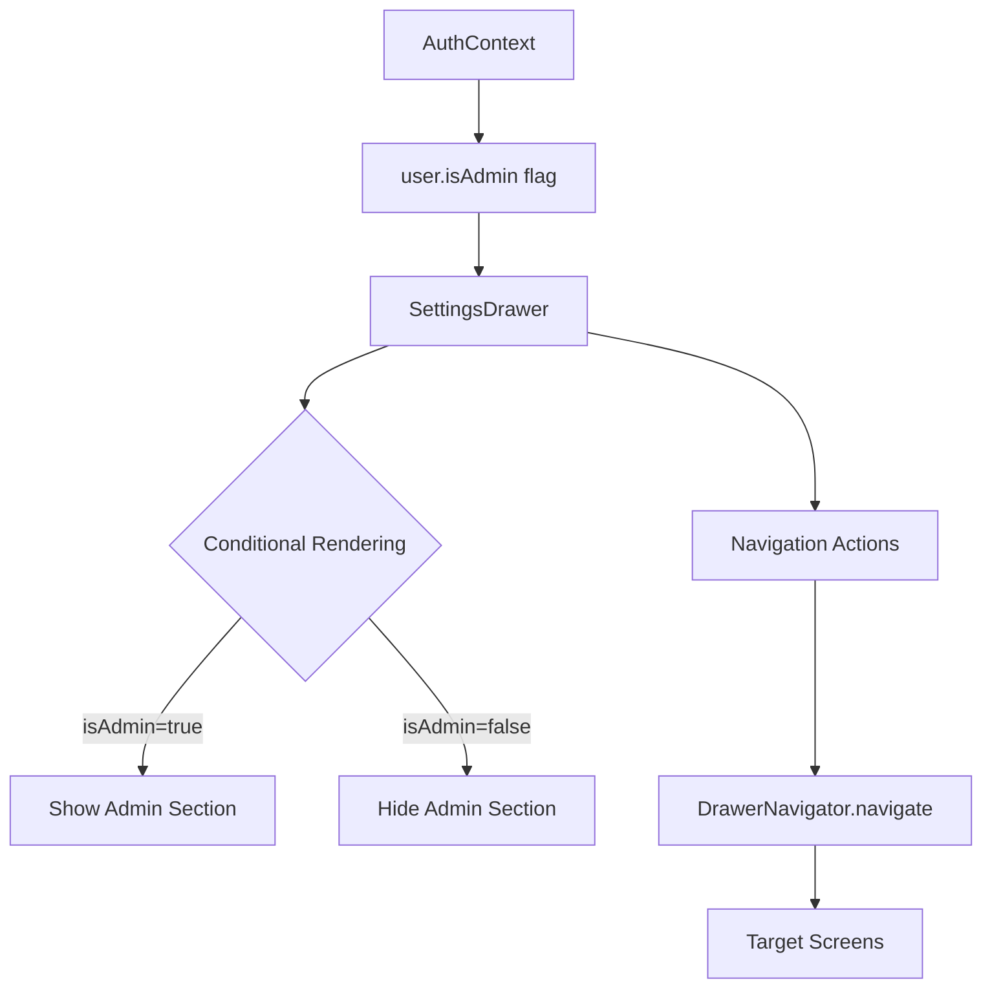

# Admin UX Technical Architecture Plan

## Executive Summary

This document provides the technical architecture and implementation plan for admin UX improvements in the DiscBaboons mobile app. The plan follows TDD methodology with the thinnest possible slices, ensuring each increment is independently testable and deployable.

## Codebase Analysis

### Current Architecture Strengths
1. **AuthContext** properly stores `user.isAdmin` flag from JWT token
2. **SettingsDrawer** component already exists with clear structure
3. **Navigation** architecture supports nested navigation with DrawerNavigator -> AppNavigator
4. **Theme System** uses `useThemeColors()` hook consistently
5. **Testing Infrastructure** follows Martin Fowler's Testing Pyramid with clear patterns

### Key Integration Points
- `AuthContext.user.isAdmin` - Available throughout app for conditional rendering
- `SettingsDrawer` - Main component requiring enhancement (lines 163-191 for navigation items)
- `DrawerNavigator` - Navigation structure already supports all required screens
- `EmptyBagsScreen` - Lines 83-108 contain features to be relocated

## Technical Architecture

### 1. Component Hierarchy

```
SettingsDrawer (Enhanced)
├── Header Section (Existing)
│   ├── Close Button
│   └── UserInfoSection (Enhanced)
│       ├── Avatar
│       ├── Username
│       ├── Email
│       └── AdminBadge (New) - Conditional on user.isAdmin
├── Navigation ScrollView
│   ├── Disc Database Section (New)
│   │   ├── SectionHeader
│   │   ├── Search Discs NavItem
│   │   └── Submit New Disc NavItem
│   ├── Admin Section (New) - Conditional on user.isAdmin
│   │   ├── SectionHeader with Admin Icon
│   │   └── Pending Discs NavItem
│   ├── General Section (Existing)
│   │   ├── Settings NavItem
│   │   └── About NavItem
└── Footer (Existing)
    └── LogoutButton
```

### 2. Data Flow



### 3. State Management

No new state management required. Leveraging:
- `AuthContext` for user admin status
- Component-level state for UI interactions only
- Existing navigation state

### 4. Visual Design Patterns

#### Admin Indicator Component
```javascript
// Reusable admin badge component
const AdminBadge = ({ size = 'small' }) => {
  const colors = useThemeColors();
  return (
    <View style={[styles.badge, styles[size]]}>
      <Icon name="shield-checkmark" size={12} color={colors.adminAccent} />
      <Text style={styles.badgeText}>Admin</Text>
    </View>
  );
};
```

#### Theme Extension for Admin Colors
```javascript
// Add to each theme object
adminAccent: '#FFD700', // Gold color for admin indicators
adminBackground: 'rgba(255, 215, 0, 0.1)', // Subtle gold background
```

## Implementation Slices (TDD Approach)

### Phase 1: Foundation (Critical Path)

#### Slice 1.1: Add Admin Accent Colors to Theme System
**Test First:**
```javascript
// themes.test.js
it('should have adminAccent color defined in light theme', () => {
  expect(themes.light.adminAccent).toBeDefined();
  expect(themes.light.adminAccent).toBe('#FFD700');
});
```
**Implementation:** Add `adminAccent` and `adminBackground` to all theme objects
**Acceptance:** Theme colors available via `useThemeColors().adminAccent`

#### Slice 1.2: Create AdminBadge Component
**Test First:**
```javascript
// AdminBadge.test.js
it('should export a component', () => {
  expect(AdminBadge).toBeDefined();
});
it('should render shield icon and Admin text', () => {
  render(<AdminBadge />);
  expect(screen.getByText('Admin')).toBeTruthy();
});
```
**Implementation:** Create reusable AdminBadge component
**Acceptance:** Component renders with icon and text

#### Slice 1.3: Add Admin Badge to SettingsDrawer Header
**Test First:**
```javascript
// SettingsDrawer.test.js
it('should show admin badge for admin users', () => {
  const adminUser = { ...mockUser, isAdmin: true };
  render(<SettingsDrawer />, { authContext: { user: adminUser }});
  expect(screen.getByTestId('admin-badge')).toBeTruthy();
});
```
**Implementation:** Conditionally render AdminBadge in user info section
**Acceptance:** Badge appears only for admin users

### Phase 2: Disc Database Section (All Users)

#### Slice 2.1: Add Section Divider Component
**Test First:**
```javascript
// SettingsDrawer.test.js
it('should render section headers', () => {
  render(<SettingsDrawer />);
  expect(screen.getByText('Disc Database')).toBeTruthy();
});
```
**Implementation:** Create SectionHeader component with icon and title
**Acceptance:** Section headers display with proper styling

#### Slice 2.2: Add Search Discs Navigation Item
**Test First:**
```javascript
it('should navigate to DiscSearchScreen when Search Discs is pressed', () => {
  render(<SettingsDrawer navigation={mockNavigation} />);
  fireEvent.press(screen.getByText('Search Discs'));
  expect(mockNavigation.navigate).toHaveBeenCalledWith('App', { screen: 'DiscSearchScreen' });
});
```
**Implementation:** Add Search Discs TouchableOpacity with navigation
**Acceptance:** Pressing navigates to DiscSearchScreen

#### Slice 2.3: Add Submit New Disc Navigation Item
**Test First:**
```javascript
it('should navigate to SubmitDiscScreen when Submit New Disc is pressed', () => {
  render(<SettingsDrawer navigation={mockNavigation} />);
  fireEvent.press(screen.getByText('Submit New Disc'));
  expect(mockNavigation.navigate).toHaveBeenCalledWith('App', { screen: 'SubmitDiscScreen' });
});
```
**Implementation:** Add Submit New Disc TouchableOpacity with navigation
**Acceptance:** Pressing navigates to SubmitDiscScreen

### Phase 3: Admin Section (Admin Users Only)

#### Slice 3.1: Conditionally Render Admin Section
**Test First:**
```javascript
it('should show admin section for admin users only', () => {
  const adminUser = { ...mockUser, isAdmin: true };
  render(<SettingsDrawer />, { authContext: { user: adminUser }});
  expect(screen.getByText('Administration')).toBeTruthy();
  expect(screen.getByText('Pending Discs')).toBeTruthy();
});
```
**Implementation:** Add conditional admin section based on user.isAdmin
**Acceptance:** Admin section visible only to admin users

#### Slice 3.2: Add Pending Discs Navigation
**Test First:**
```javascript
it('should navigate to AdminDiscScreen when Pending Discs is pressed', () => {
  const adminUser = { ...mockUser, isAdmin: true };
  render(<SettingsDrawer navigation={mockNavigation} />, { authContext: { user: adminUser }});
  fireEvent.press(screen.getByText('Pending Discs'));
  expect(mockNavigation.navigate).toHaveBeenCalledWith('App', { screen: 'AdminDiscScreen' });
});
```
**Implementation:** Add Pending Discs navigation item in admin section
**Acceptance:** Admin users can navigate to AdminDiscScreen

### Phase 4: EmptyBagsScreen Cleanup

#### Slice 4.1: Remove Submit New Disc Button
**Test First:**
```javascript
// EmptyBagsScreen.test.js
it('should not render Submit New Disc button', () => {
  render(<EmptyBagsScreen />);
  expect(screen.queryByText('Submit New Disc')).toBeNull();
});
```
**Implementation:** Remove Submit New Disc button from EmptyBagsScreen
**Acceptance:** Button no longer appears on EmptyBagsScreen

#### Slice 4.2: Remove Admin Section
**Test First:**
```javascript
it('should not render admin section even for admin users', () => {
  const adminUser = { ...mockUser, isAdmin: true };
  render(<EmptyBagsScreen />, { authContext: { user: adminUser }});
  expect(screen.queryByText('Admin: Approve Discs')).toBeNull();
});
```
**Implementation:** Remove admin conditional rendering from EmptyBagsScreen
**Acceptance:** No admin features on EmptyBagsScreen

### Phase 5: Visual Polish & Accessibility

#### Slice 5.1: Add Section Icons
**Test First:**
```javascript
it('should render disc icon for Disc Database section', () => {
  render(<SettingsDrawer />);
  expect(screen.getByTestId('disc-database-icon')).toBeTruthy();
});
```
**Implementation:** Add appropriate icons to section headers
**Acceptance:** Icons display correctly for each section

#### Slice 5.2: Accessibility Labels
**Test First:**
```javascript
it('should have accessibility labels for admin features', () => {
  const adminUser = { ...mockUser, isAdmin: true };
  render(<SettingsDrawer />, { authContext: { user: adminUser }});
  const pendingDiscs = screen.getByText('Pending Discs');
  expect(pendingDiscs.props.accessibilityLabel).toBe('Navigate to pending disc approvals');
});
```
**Implementation:** Add accessibility labels to all navigation items
**Acceptance:** Screen readers properly announce navigation items

## Testing Strategy

### Unit Tests
1. **AdminBadge Component**
   - Renders correctly
   - Respects size prop
   - Uses theme colors

2. **Theme Extensions**
   - Admin colors defined
   - Colors accessible via hook

3. **Section Components**
   - Conditional rendering logic
   - Navigation handlers

### Integration Tests
1. **Admin User Flow**
```javascript
// admin.navigation.integration.test.js
it('should allow admin to navigate from drawer to AdminDiscScreen', async () => {
  // Setup admin user
  // Open drawer
  // Click Pending Discs
  // Verify navigation to AdminDiscScreen
});
```

2. **Regular User Flow**
```javascript
// user.navigation.integration.test.js
it('should allow user to submit disc from drawer', async () => {
  // Setup regular user
  // Open drawer
  // Click Submit New Disc
  // Verify navigation to SubmitDiscScreen
});
```

### Visual Regression Tests
- Screenshot tests for drawer with/without admin status
- Theme compatibility tests (light/dark/blackout)

## Component Design Patterns

### 1. Section Header Pattern
```javascript
const SectionHeader = ({ title, icon, testID }) => {
  const colors = useThemeColors();
  return (
    <View style={styles.sectionHeader} testID={testID}>
      <Icon name={icon} size={18} color={colors.textLight} />
      <Text style={[styles.sectionTitle, { color: colors.text }]}>{title}</Text>
    </View>
  );
};
```

### 2. Navigation Item Pattern
```javascript
const DrawerNavItem = ({ title, icon, onPress, variant = 'default' }) => {
  const colors = useThemeColors();
  const isAdmin = variant === 'admin';
  
  return (
    <TouchableOpacity 
      style={[styles.navItem, isAdmin && styles.adminNavItem]}
      onPress={onPress}
    >
      <Icon 
        name={icon} 
        size={20} 
        color={isAdmin ? colors.adminAccent : colors.primary} 
      />
      <Text style={[styles.navText, { color: colors.text }]}>{title}</Text>
    </TouchableOpacity>
  );
};
```

### 3. Conditional Section Pattern
```javascript
const AdminSection = () => {
  const { user } = useAuth();
  
  if (!user?.isAdmin) return null;
  
  return (
    <View style={styles.section}>
      <SectionHeader title="Administration" icon="shield-checkmark" />
      {/* Admin navigation items */}
    </View>
  );
};
```

## Risk Assessment & Mitigation

### High Priority Risks

#### Risk 1: Navigation State Corruption
**Impact:** Users unable to navigate properly
**Probability:** Low
**Mitigation:** 
- Test all navigation paths thoroughly
- Implement navigation error boundaries
- Add fallback navigation reset

#### Risk 2: Admin Permission Leakage
**Impact:** Non-admin users access admin features
**Probability:** Very Low
**Mitigation:**
- Server-side validation remains unchanged
- Client-side checks are UI-only
- JWT token validation on all admin endpoints

### Medium Priority Risks

#### Risk 3: Performance Impact on Drawer
**Impact:** Slow drawer opening
**Probability:** Low
**Mitigation:**
- Use React.memo for drawer components
- Lazy load admin section
- Profile with React DevTools

#### Risk 4: Theme Inconsistency
**Impact:** Visual bugs in different themes
**Probability:** Medium
**Mitigation:**
- Test all three themes (light/dark/blackout)
- Use theme colors consistently
- Add visual regression tests

### Low Priority Risks

#### Risk 5: User Confusion During Migration
**Impact:** Users can't find features
**Probability:** Low
**Mitigation:**
- Keep Search Discs in EmptyBagsScreen initially
- Add tooltips on first use
- Update app store description

## Performance Considerations

### Optimization Strategies
1. **Memoization**
   - Wrap SettingsDrawer in React.memo
   - Memoize navigation handlers with useCallback
   - Memoize conditional sections

2. **Lazy Loading**
   - Admin section renders only when needed
   - Icons loaded on demand

3. **Render Optimization**
   - Use StyleSheet.create for styles
   - Avoid inline style objects
   - Minimize re-renders with proper dependencies

### Performance Metrics
- Drawer open time: < 100ms
- Navigation transition: < 200ms
- Memory usage: No increase > 5MB

## Migration Strategy

### Rollout Plan
1. **Phase 1**: Add new features to SettingsDrawer (keep EmptyBagsScreen unchanged)
2. **Phase 2**: Monitor usage analytics for 1 week
3. **Phase 3**: Remove redundant features from EmptyBagsScreen
4. **Phase 4**: Update documentation and help screens

### Rollback Plan
- Feature flags for each phase
- Ability to restore EmptyBagsScreen functionality
- A/B testing capability

## Success Criteria

### Technical Success Metrics
- 100% test coverage for new components
- No performance regression
- Zero navigation errors in production

### User Success Metrics
- Admin task completion rate > 95%
- Disc submission increase > 20%
- User satisfaction score > 4.5/5

### Business Success Metrics
- Reduced support tickets for "can't find admin features"
- Increased disc database contributions
- Improved admin efficiency

## Next Steps

1. **Immediate Actions**
   - Review and approve architecture
   - Set up feature flags
   - Begin Phase 1 implementation

2. **Week 1 Goals**
   - Complete Phase 1 & 2 (Foundation & Disc Database)
   - Unit tests at 100% coverage
   - Integration tests passing

3. **Week 2 Goals**
   - Complete Phase 3 & 4 (Admin Section & Cleanup)
   - Cross-platform testing
   - Performance profiling

4. **Week 3 Goals**
   - Phase 5 (Polish & Accessibility)
   - UAT with admin users
   - Documentation updates